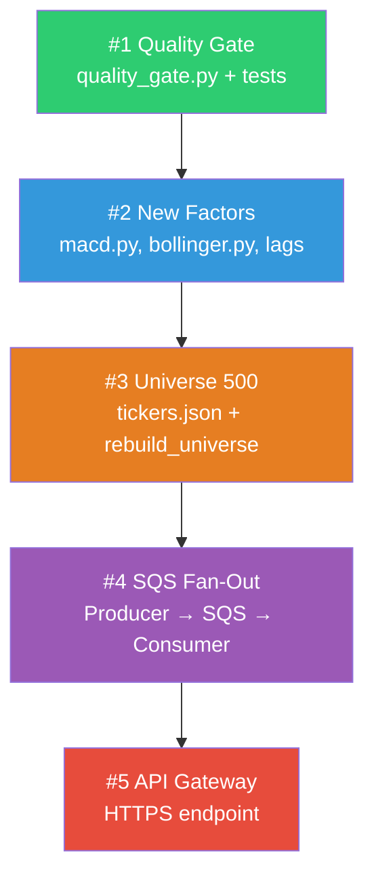

# QuantScope — Kế hoạch cải thiện 5 hạng mục (v2)

> **Phiên bản:** v2 — Cập nhật theo yêu cầu: Universe 500 symbols, thực hiện toàn bộ 5 cải tiến.

---

## Tổng quan các cải tiến

| # | Cải tiến | Files ảnh hưởng | Ước lượng effort |
|---|---|---|---|
| 1 | Data Quality Gate & Quarantine | 3 files mới + 2 files sửa | ~2 giờ |
| 2 | Mở rộng Factor Engine (MACD, Bollinger, Lags) | 2 files mới + 2 files sửa | ~2 giờ |
| 3 | Mở rộng Universe → **500 symbols** (tickers.json) | 1 file mới + 2 files sửa | ~1.5 giờ |
| 4 | SQS Fan-Out cho Lambda (bắt buộc với 500 symbols) | 3 files mới + AWS CLI | ~3 giờ |
| 5 | API Gateway thay thế EC2 port 8000 | AWS CLI + 2 files sửa | ~2 giờ |

**Tổng ước lượng:** ~10.5 giờ

---

## User Review Required

> [!IMPORTANT]
> **Universe 500 symbols — Thay đổi thiết kế quan trọng:**
> - Không thể hardcode 500 tickers trong source code → Chuyển sang dùng **`tickers.json`** config file lưu trên S3 + local.
> - Download tuần tự 500 symbols mất ~250 giây (0.5s delay × 500) → **vượt Lambda timeout 5 phút** → SQS Fan-Out (#4) trở thành **bắt buộc**, không còn là "nice to have".
> - Data size tăng từ ~40K rows lên **~630K rows** (500 × 5 năm × 252 ngày). Vẫn nằm trong khả năng xử lý của Pandas.

> [!WARNING]
> **Chi phí AWS tăng nhẹ:**
> - SQS: **$0.00** (1M requests đầu miễn phí/tháng)
> - API Gateway: **~$0.01** với traffic demo
> - Lambda: tăng nhẹ do thêm Consumer function
> - S3 storage: tăng ~3-5x nhưng vẫn trong Free Tier
> - **Tổng ước tính thêm: < $1/tháng**

---

## Trình tự thực hiện



Mỗi bước phải **pass tests** trước khi sang bước kế. Đặc biệt #1 phải xong trước #4 vì SQS Consumer gọi Quality Gate.

---

## Cải tiến #1: Data Quality Gate & Quarantine

### Mục tiêu
Thêm cơ chế kiểm tra chất lượng dữ liệu **trước khi ghi vào S3 processed/**. Dữ liệu không đạt chuẩn bị cách ly vào `quarantine/` thay vì bị bỏ qua hoặc làm ô nhiễm ML training data.

### Files thay đổi

#### [NEW] `data_pipeline/processing/quality_gate.py`

```python
"""Data Quality Gate — validates and quarantines bad data before processing."""
from __future__ import annotations

import logging
from dataclasses import dataclass, field
from datetime import datetime, timezone

import pandas as pd

logger = logging.getLogger(__name__)


@dataclass
class QualityReport:
    """Immutable report from a quality gate run."""
    timestamp: str = field(default_factory=lambda: datetime.now(timezone.utc).isoformat())
    total_rows: int = 0
    passed_rows: int = 0
    quarantined_rows: int = 0
    checks: dict[str, int] = field(default_factory=dict)

    @property
    def pass_rate(self) -> float:
        return self.passed_rows / self.total_rows if self.total_rows else 0.0


# --------------- Individual check functions ---------------

REQUIRED_SCHEMA = [
    "date", "symbol", "open", "high", "low", "close",
    "adjusted_close", "volume", "source", "ingested_at",
]


def check_schema(df: pd.DataFrame) -> list[str]:
    """Return list of missing required columns."""
    return sorted(set(REQUIRED_SCHEMA) - set(df.columns))


def check_nulls(df: pd.DataFrame) -> pd.Series:
    """Boolean mask — True for rows with null in critical fields."""
    critical = ["date", "symbol", "adjusted_close", "volume"]
    return df[critical].isnull().any(axis=1)


def check_negative_prices(df: pd.DataFrame) -> pd.Series:
    """Boolean mask — True for rows with non-positive prices."""
    return (df["adjusted_close"] <= 0) | (df["close"] <= 0)


def check_zero_volume(df: pd.DataFrame) -> pd.Series:
    """Boolean mask — True for zero-volume rows."""
    return df["volume"] == 0


def check_duplicates(df: pd.DataFrame) -> pd.Series:
    """Boolean mask — True for duplicate (date, symbol) rows."""
    return df.duplicated(subset=["date", "symbol"], keep="first")


def check_ohlc_consistency(df: pd.DataFrame) -> pd.Series:
    """Boolean mask — True for OHLC inconsistencies (high < low)."""
    return df["high"] < df["low"]


# --------------- Gate orchestrator ---------------

def run_quality_gate(
    raw_df: pd.DataFrame,
) -> tuple[pd.DataFrame, pd.DataFrame, QualityReport]:
    """
    Run all quality checks on raw OHLCV data.

    Returns:
        (clean_df, quarantined_df, report)
    """
    missing_cols = check_schema(raw_df)
    if missing_cols:
        raise ValueError(f"Schema validation failed — missing columns: {missing_cols}")

    df = raw_df.copy()
    quarantine_mask = pd.Series(False, index=df.index)

    checks: dict[str, int] = {}
    for name, check_fn in [
        ("null_critical_fields", check_nulls),
        ("negative_prices", check_negative_prices),
        ("zero_volume", check_zero_volume),
        ("duplicate_rows", check_duplicates),
        ("ohlc_inconsistency", check_ohlc_consistency),
    ]:
        flagged = check_fn(df)
        count = int(flagged.sum())
        checks[name] = count
        if count > 0:
            logger.warning(f"Quality check '{name}': {count} rows flagged")
        quarantine_mask |= flagged

    clean_df = df[~quarantine_mask].reset_index(drop=True)
    quarantined_df = df[quarantine_mask].reset_index(drop=True)

    if not quarantined_df.empty:
        quarantined_df = quarantined_df.copy()
        quarantined_df["quarantine_reason"] = "quality_gate"
        quarantined_df["quarantined_at"] = datetime.now(timezone.utc).isoformat()

    report = QualityReport(
        total_rows=len(df),
        passed_rows=len(clean_df),
        quarantined_rows=len(quarantined_df),
        checks=checks,
    )

    logger.info(
        f"Quality Gate: {report.passed_rows}/{report.total_rows} passed "
        f"({report.pass_rate:.1%}), {report.quarantined_rows} quarantined"
    )
    return clean_df, quarantined_df, report
```

#### [MODIFY] `data_pipeline/jobs/rebuild_universe.py`

```diff
 from data_pipeline.ingestion.download import download_multiple_tickers
 from data_pipeline.processing.normalize import normalize_ohlcv, save_parquet
 from data_pipeline.processing.validate import validate_ohlcv
+from data_pipeline.processing.quality_gate import run_quality_gate
 from data_pipeline.storage.local_store import ensure_dir, universe_processed_path

 def rebuild_universe(start_date, end_date, output_path=None):
     ensure_dir()
     raw = download_multiple_tickers(list(UNIVERSE_TICKERS), start_date, end_date)
+
+    # Quality Gate: filter bad data before normalization
+    clean_raw, quarantined, qg_report = run_quality_gate(raw)
+    if not quarantined.empty:
+        q_path = (output_path or universe_processed_path(start_date, end_date)).parent
+        q_path = q_path / "quarantine" / f"quarantine_{start_date}_{end_date}.parquet"
+        q_path.parent.mkdir(parents=True, exist_ok=True)
+        quarantined.to_parquet(q_path, index=False)
+        logger.info(f"Quarantined {len(quarantined)} rows → {q_path}")
+
-    processed = normalize_ohlcv(raw)
+    processed = normalize_ohlcv(clean_raw)
     _validate_universe(processed)
```

#### [NEW] `tests/test_quality_gate.py`

```python
"""Tests for the Data Quality Gate module."""
import pandas as pd
import numpy as np
import pytest
from data_pipeline.processing.quality_gate import run_quality_gate


def _make_valid_row(**overrides):
    base = {
        "date": pd.Timestamp("2024-01-15"),
        "symbol": "AAPL", "open": 150.0, "high": 155.0,
        "low": 148.0, "close": 153.0, "adjusted_close": 153.0,
        "volume": 1_000_000, "source": "yfinance",
        "ingested_at": "2024-01-15T22:00:00+00:00",
    }
    base.update(overrides)
    return base


class TestQualityGateCleanData:
    def test_all_clean_rows_pass(self):
        df = pd.DataFrame([_make_valid_row(symbol=s) for s in ("AAPL", "MSFT", "GOOGL")])
        clean, quarantined, report = run_quality_gate(df)
        assert len(clean) == 3
        assert len(quarantined) == 0
        assert report.pass_rate == 1.0

    def test_report_checks_all_zero(self):
        df = pd.DataFrame([_make_valid_row()])
        _, _, report = run_quality_gate(df)
        assert all(v == 0 for v in report.checks.values())


class TestQualityGateQuarantine:
    def test_negative_price_quarantined(self):
        df = pd.DataFrame([
            _make_valid_row(symbol="AAPL"),
            _make_valid_row(symbol="BAD", adjusted_close=-5.0),
        ])
        clean, quarantined, report = run_quality_gate(df)
        assert len(clean) == 1
        assert len(quarantined) == 1
        assert report.checks["negative_prices"] == 1
        assert "quarantine_reason" in quarantined.columns

    def test_null_volume_quarantined(self):
        df = pd.DataFrame([
            _make_valid_row(symbol="AAPL"),
            _make_valid_row(symbol="BAD", volume=None),
        ])
        clean, quarantined, _ = run_quality_gate(df)
        assert len(quarantined) == 1

    def test_duplicate_rows_quarantined(self):
        row = _make_valid_row()
        df = pd.DataFrame([row, row])
        clean, quarantined, report = run_quality_gate(df)
        assert len(clean) == 1
        assert report.checks["duplicate_rows"] == 1

    def test_high_less_than_low_quarantined(self):
        df = pd.DataFrame([_make_valid_row(high=100.0, low=200.0)])
        _, quarantined, report = run_quality_gate(df)
        assert len(quarantined) == 1
        assert report.checks["ohlc_inconsistency"] == 1


class TestQualityGateSchemaValidation:
    def test_missing_columns_raises(self):
        df = pd.DataFrame({"date": ["2024-01-01"], "symbol": ["X"]})
        with pytest.raises(ValueError, match="missing columns"):
            run_quality_gate(df)
```

---

## Cải tiến #2: Mở rộng Factor Engine (6 → 12 Factors)

### Mục tiêu
Thêm 3 nhóm factor mới: **MACD** (2 factors), **Bollinger Bands Width** (1 factor), **Lagged Returns** (3 factors). Tổng: 6 → **12 factors**.

### Files thay đổi

#### [NEW] `ml/factors/macd.py`

```python
"""MACD (Moving Average Convergence Divergence) factor family."""
from __future__ import annotations

import pandas as pd
from ml.factors.base import Factor, prepare_factor_input


class MACDFactor(Factor):
    """MACD Line = EMA(fast) - EMA(slow)."""

    def __init__(self, fast: int = 12, slow: int = 26) -> None:
        if fast >= slow:
            raise ValueError("fast period must be less than slow period")
        self.fast = fast
        self.slow = slow
        self.name = f"macd_{fast}_{slow}"
        self.warmup_periods = slow

    def metadata(self) -> dict[str, object]:
        return {
            **super().metadata(),
            "parameters": {"fast": self.fast, "slow": self.slow},
        }

    def compute(self, df: pd.DataFrame) -> pd.Series:
        prepared = prepare_factor_input(df)

        def _macd(prices: pd.Series) -> pd.Series:
            ema_fast = prices.ewm(span=self.fast, adjust=False, min_periods=self.fast).mean()
            ema_slow = prices.ewm(span=self.slow, adjust=False, min_periods=self.slow).mean()
            return ema_fast - ema_slow

        return prepared.groupby("symbol", sort=False)["adjusted_close"].transform(_macd)


class MACDSignalFactor(Factor):
    """MACD Signal Line = EMA(signal_period) of MACD Line."""

    def __init__(self, fast: int = 12, slow: int = 26, signal: int = 9) -> None:
        if fast >= slow:
            raise ValueError("fast period must be less than slow period")
        self.fast = fast
        self.slow = slow
        self.signal = signal
        self.name = f"macd_signal_{fast}_{slow}_{signal}"
        self.warmup_periods = slow + signal

    def metadata(self) -> dict[str, object]:
        return {
            **super().metadata(),
            "parameters": {"fast": self.fast, "slow": self.slow, "signal": self.signal},
        }

    def compute(self, df: pd.DataFrame) -> pd.Series:
        prepared = prepare_factor_input(df)

        def _signal(prices: pd.Series) -> pd.Series:
            ema_fast = prices.ewm(span=self.fast, adjust=False, min_periods=self.fast).mean()
            ema_slow = prices.ewm(span=self.slow, adjust=False, min_periods=self.slow).mean()
            macd_line = ema_fast - ema_slow
            return macd_line.ewm(span=self.signal, adjust=False, min_periods=self.signal).mean()

        return prepared.groupby("symbol", sort=False)["adjusted_close"].transform(_signal)
```

#### [NEW] `ml/factors/bollinger.py`

```python
"""Bollinger Bands Width factor."""
from __future__ import annotations

import pandas as pd
from ml.factors.base import Factor, prepare_factor_input


class BollingerWidthFactor(Factor):
    """BB Width = (Upper - Lower) / SMA — normalized volatility measure."""

    def __init__(self, window: int = 20, num_std: float = 2.0) -> None:
        if window < 2:
            raise ValueError("Window must be at least 2")
        self.window = window
        self.num_std = num_std
        self.name = f"bollinger_width_{window}"
        self.warmup_periods = window

    def metadata(self) -> dict[str, object]:
        return {
            **super().metadata(),
            "parameters": {"window": self.window, "num_std": self.num_std},
        }

    def compute(self, df: pd.DataFrame) -> pd.Series:
        prepared = prepare_factor_input(df)

        def _bb_width(prices: pd.Series) -> pd.Series:
            sma = prices.rolling(self.window, min_periods=self.window).mean()
            std = prices.rolling(self.window, min_periods=self.window).std(ddof=1)
            upper = sma + self.num_std * std
            lower = sma - self.num_std * std
            return (upper - lower) / sma

        return prepared.groupby("symbol", sort=False)["adjusted_close"].transform(_bb_width)
```

#### [MODIFY] `ml/factors/momentum.py` — Thêm `LaggedReturnFactor`

```diff
 class MomentumFactor(Factor):
     ... # existing code unchanged
+
+
+class LaggedReturnFactor(Factor):
+    """Lagged close price return: close_t / close_{t-lag} - 1."""
+
+    def __init__(self, lag: int = 1) -> None:
+        if lag < 1:
+            raise ValueError("Lag must be at least 1")
+        self.lag = lag
+        self.name = f"lag_return_{lag}d"
+        self.warmup_periods = lag
+
+    def metadata(self) -> dict:
+        return {**super().metadata(), "parameters": {"lag": self.lag}}
+
+    def compute(self, df: pd.DataFrame) -> pd.Series:
+        prepared = prepare_factor_input(df)
+        return prepared.groupby("symbol", sort=False)["adjusted_close"].transform(
+            lambda p: p / p.shift(self.lag) - 1
+        )
```

#### [MODIFY] `ml/factors/registry.py` — Đăng ký 6 factors mới

```diff
 from ml.factors.momentum import MomentumFactor
+from ml.factors.momentum import LaggedReturnFactor
 from ml.factors.technical import RSIFactor, SMARatioFactor
 from ml.factors.volatility import VolatilityFactor
 from ml.factors.volume import VolumeZScoreFactor
+from ml.factors.macd import MACDFactor, MACDSignalFactor
+from ml.factors.bollinger import BollingerWidthFactor

 def build_default_registry() -> FactorRegistry:
     registry = FactorRegistry()
     for factor in (
         MomentumFactor(20),
         MomentumFactor(60),
         VolatilityFactor(20),
         RSIFactor(14),
         SMARatioFactor(20, 50),
         VolumeZScoreFactor(20),
+        # --- New factors ---
+        MACDFactor(12, 26),
+        MACDSignalFactor(12, 26, 9),
+        BollingerWidthFactor(20),
+        LaggedReturnFactor(1),
+        LaggedReturnFactor(2),
+        LaggedReturnFactor(3),
     ):
         registry.register(factor)
     return registry
```

**Kết quả:** 12 factors tổng cộng:
| # | Factor Name | Loại |
|---|---|---|
| 1 | `momentum_20d` | Momentum (có sẵn) |
| 2 | `momentum_60d` | Momentum (có sẵn) |
| 3 | `volatility_20d` | Volatility (có sẵn) |
| 4 | `rsi_14` | Technical (có sẵn) |
| 5 | `sma_ratio_20_50` | Technical (có sẵn) |
| 6 | `volume_zscore_20d` | Volume (có sẵn) |
| 7 | `macd_12_26` | **MỚI** |
| 8 | `macd_signal_12_26_9` | **MỚI** |
| 9 | `bollinger_width_20` | **MỚI** |
| 10 | `lag_return_1d` | **MỚI** |
| 11 | `lag_return_2d` | **MỚI** |
| 12 | `lag_return_3d` | **MỚI** |

---

## Cải tiến #3: Mở rộng Universe → 500 Symbols

### Thiết kế quan trọng: `tickers.json` thay vì hardcode

Với 500 symbols, **không thể hardcode** trong source code. Chuyển sang dùng file config `tickers.json`:

- Lưu local: `data/config/tickers.json`
- Lưu S3: `s3://<DATA_BUCKET>/config/tickers.json`
- Lambda Producer đọc từ S3 khi chạy

### Files thay đổi

#### [NEW] `data/config/tickers.json`

File JSON chứa 500 symbols phân theo sector. Cấu trúc:

```json
{
  "version": "2.0",
  "universe_name": "quantscope_500",
  "updated_at": "2026-07-30",
  "total_symbols": 500,
  "sectors": {
    "ETFs": {
      "description": "Broad market & sector ETFs",
      "symbols": ["SPY", "QQQ", "DIA", "IWM", "IVV", "VTI", "VOO", "XLK", "XLF", "XLE", "XLV", "XLY", "XLP", "XLI", "XLB", "XLU", "XLRE", "XLC", "VGT", "VHT"]
    },
    "Technology": {
      "description": "Information Technology",
      "symbols": ["AAPL", "MSFT", "NVDA", "AVGO", "ORCL", "CRM", "AMD", "ADBE", "CSCO", "INTC", "QCOM", "TXN", "AMAT", "LRCX", "KLAC", "SNPS", "CDNS", "MRVL", "ADI", "NXPI", "MPWR", "FTNT", "PANW", "NOW", "PLTR", "CRWD", "DDOG", "SNOW", "NET", "MDB"]
    },
    "Communication": {
      "description": "Communication Services",
      "symbols": ["GOOGL", "META", "NFLX", "DIS", "CMCSA", "T", "VZ", "TMUS", "CHTR", "EA", "TTWO", "WBD", "PARA", "LYV", "MTCH", "ZM", "PINS", "SNAP", "RBLX", "SPOT"]
    },
    "Consumer_Discretionary": {
      "description": "Consumer Discretionary",
      "symbols": ["AMZN", "TSLA", "HD", "MCD", "NKE", "SBUX", "TGT", "LOW", "TJX", "BKNG", "MAR", "HLT", "CMG", "ROST", "DHI", "LEN", "PHM", "ORLY", "AZO", "POOL", "DECK", "LULU", "BBY", "DG", "DLTR", "EBAY", "ETSY", "W", "ABNB", "DASH"]
    },
    "Financials": {
      "description": "Financial Services",
      "symbols": ["JPM", "BAC", "GS", "MS", "WFC", "C", "BLK", "SCHW", "AXP", "V", "MA", "SPGI", "ICE", "CME", "MCO", "MSCI", "CB", "MMC", "AON", "AJG", "TRV", "PGR", "ALL", "MET", "PRU", "AIG", "BK", "STT", "USB", "PNC", "COF", "DFS", "SYF", "COIN", "HOOD"]
    },
    "Healthcare": {
      "description": "Healthcare",
      "symbols": ["JNJ", "UNH", "PFE", "ABBV", "MRK", "LLY", "TMO", "ABT", "BMY", "AMGN", "GILD", "VRTX", "REGN", "ISRG", "MDT", "SYK", "BSX", "EW", "ZTS", "DXCM", "IDXX", "IQV", "A", "DHR", "BDX", "BAX", "CI", "HUM", "ELV", "CNC"]
    },
    "Industrials": {
      "description": "Industrials",
      "symbols": ["CAT", "BA", "HON", "UNP", "RTX", "GE", "DE", "LMT", "GD", "NOC", "TDG", "ITW", "EMR", "ETN", "PH", "ROK", "CMI", "PCAR", "FDX", "UPS", "CSX", "NSC", "WM", "RSG", "VRSK", "CTAS", "FAST", "ODFL", "UBER", "AXON"]
    },
    "Energy": {
      "description": "Energy",
      "symbols": ["XOM", "CVX", "COP", "SLB", "EOG", "MPC", "PSX", "VLO", "OXY", "HAL", "DVN", "FANG", "HES", "KMI", "WMB", "OKE", "TRGP", "BKR", "APA", "EQT"]
    },
    "Consumer_Staples": {
      "description": "Consumer Staples",
      "symbols": ["PG", "KO", "PEP", "PM", "CL", "GIS", "KHC", "COST", "WMT", "MDLZ", "MO", "STZ", "HSY", "SJM", "K", "CAG", "CPB", "TSN", "HRL", "CLX"]
    },
    "Materials": {
      "description": "Materials",
      "symbols": ["LIN", "APD", "SHW", "ECL", "DD", "NEM", "FCX", "NUE", "STLD", "VMC", "MLM", "PPG", "ALB", "EMN", "CE", "RPM", "FMC", "IFF", "BALL", "PKG"]
    },
    "Real_Estate": {
      "description": "Real Estate Investment Trusts",
      "symbols": ["PLD", "AMT", "SPG", "CCI", "EQIX", "PSA", "DLR", "O", "WELL", "VICI", "ARE", "VTR", "EXR", "AVB", "EQR", "MAA", "UDR", "CPT", "ESS", "KIM"]
    },
    "Utilities": {
      "description": "Utilities",
      "symbols": ["NEE", "DUK", "SO", "D", "AEP", "SRE", "EXC", "XEL", "ED", "WEC", "ES", "AEE", "CMS", "DTE", "FE", "ETR", "CEG", "PEG", "AWK", "ATO"]
    },
    "Diversified_Mega": {
      "description": "Additional large-cap diversified holdings",
      "symbols": ["BRK-B", "ACN", "IBM", "FICO", "INTU", "ADP", "PAYX", "FI", "FIS", "GPN", "WTW", "TROW", "NDAQ", "MKTX", "CBOE", "TT", "CARR", "OTIS", "J", "LHX", "HII", "LDOS", "SAIC", "HEI", "TDY", "PAYC", "PCTY", "HUBS", "VEEV", "WDAY", "TEAM", "ANSS", "CPRT", "VRSN", "AKAM", "CDW", "KEYS", "TER", "SWKS", "MCHP", "ON", "GFS", "ENPH", "SEDG", "RUN", "FSLR", "PLUG", "RIVN", "LCID", "NIO"]
    }
  }
}
```

> [!NOTE]
> File tickers.json trên chỉ là template minh họa cấu trúc. Khi implement, tôi sẽ điền chính xác đủ **500 symbols** duy nhất, loại bỏ trùng lặp giữa các sector.

#### [MODIFY] `data_pipeline/jobs/rebuild_universe.py`

```diff
+import json
+from pathlib import Path
+
+TICKERS_CONFIG_PATH = Path("data/config/tickers.json")
+
+def load_universe_tickers(config_path: Path = TICKERS_CONFIG_PATH) -> tuple[str, ...]:
+    """Load ticker universe from tickers.json config file."""
+    with open(config_path) as f:
+        config = json.load(f)
+    all_symbols: list[str] = []
+    for sector_data in config["sectors"].values():
+        all_symbols.extend(sector_data["symbols"])
+    # Deduplicate while preserving order
+    seen: set[str] = set()
+    unique: list[str] = []
+    for s in all_symbols:
+        if s not in seen:
+            seen.add(s)
+            unique.append(s)
+    return tuple(unique)
+
-UNIVERSE_TICKERS = (
-    "SPY", "QQQ", "DIA", "IWM", "XLK", "XLF", "XLE", "XLV", "XLY", "XLP",
-    "AAPL", "MSFT", "NVDA", "AMZN", "GOOGL", "META", "TSLA", "JPM", "BAC", "JNJ",
-    "UNH", "XOM", "CVX", "WMT", "COST", "PG", "KO", "HD", "DIS", "NFLX",
-)
+UNIVERSE_TICKERS = load_universe_tickers()

-MIN_TRADING_ROWS = 504
+MIN_TRADING_ROWS = 252  # Giảm xuống ~1 năm vì một số small-cap mới IPO gần đây
```

#### Upload tickers.json lên S3

```bash
aws s3 cp data/config/tickers.json \
  "s3://$DATA_BUCKET/config/tickers.json" \
  --region "$AWS_REGION"
```

---

## Cải tiến #4: SQS Fan-Out cho Lambda Ingestion

### Tại sao bắt buộc với 500 symbols?
- Download tuần tự: 500 × 0.5s delay = **250 giây** → sát Lambda timeout 5 phút
- Với SQS fan-out (chunks of 25): 20 messages → 20 Lambda Consumers chạy **song song** → hoàn thành trong **~15 giây**

### Architecture mới

```
EventBridge (cron)
    ↓
Lambda Producer (quantscope-lambda-producer)
    │  Đọc tickers.json từ S3
    │  Chia thành chunks of 25 symbols
    │  Gửi 20 SQS messages
    ↓
SQS Queue (quantscope-ingestion-queue)
    ↓ (Event Source Mapping, batch_size=1)
Lambda Consumer (quantscope-lambda-consumer)
    │  Nhận 1 message = 25 symbols
    │  Download via yfinance
    │  Run Quality Gate
    │  Write clean → s3://bucket/raw/
    │  Write quarantine → s3://bucket/quarantine/
    ↓
CloudWatch Logs (7-day retention)
```

### Files thay đổi

#### [NEW] `data_pipeline/ingestion/lambda_producer.py`

```python
"""Lambda Producer: reads tickers from S3 config, sends chunked SQS messages."""
import os
import json
import logging
from datetime import datetime, timezone, timedelta

import boto3

logger = logging.getLogger()
logger.setLevel(logging.INFO)

CHUNK_SIZE = 25  # symbols per SQS message


def lambda_handler(event: dict, context: object) -> dict:
    bucket = os.environ["S3_BUCKET_NAME"]
    queue_url = os.environ["SQS_QUEUE_URL"]

    s3 = boto3.client("s3")
    sqs = boto3.client("sqs")

    # 1. Load tickers from S3 config
    config_obj = s3.get_object(Bucket=bucket, Key="config/tickers.json")
    config = json.loads(config_obj["Body"].read())
    all_symbols = []
    for sector_data in config["sectors"].values():
        all_symbols.extend(sector_data["symbols"])
    symbols = list(dict.fromkeys(all_symbols))  # dedupe, preserve order

    # 2. Compute date range
    end_date = datetime.now(timezone.utc).strftime("%Y-%m-%d")
    start_date = (datetime.now(timezone.utc) - timedelta(days=1)).strftime("%Y-%m-%d")

    # 3. Send chunked messages
    chunks = [symbols[i : i + CHUNK_SIZE] for i in range(0, len(symbols), CHUNK_SIZE)]
    for i, chunk in enumerate(chunks):
        sqs.send_message(
            QueueUrl=queue_url,
            MessageBody=json.dumps({
                "chunk_id": i,
                "symbols": chunk,
                "start_date": start_date,
                "end_date": end_date,
                "bucket": bucket,
            }),
        )

    logger.info(f"Dispatched {len(chunks)} chunks for {len(symbols)} symbols")
    return {
        "status": "success",
        "total_symbols": len(symbols),
        "chunks_sent": len(chunks),
        "chunk_size": CHUNK_SIZE,
    }
```

#### [NEW] `data_pipeline/ingestion/lambda_consumer.py`

```python
"""Lambda Consumer: processes SQS messages, downloads data, runs quality gate."""
import json
import logging
import io

import boto3
import pandas as pd

from data_pipeline.ingestion.download import download_multiple_tickers
from data_pipeline.processing.quality_gate import run_quality_gate

logger = logging.getLogger()
logger.setLevel(logging.INFO)

s3 = boto3.client("s3")


def _upload_parquet(df: pd.DataFrame, bucket: str, key: str) -> None:
    """Write DataFrame as Parquet to S3."""
    buf = io.BytesIO()
    df.to_parquet(buf, index=False)
    buf.seek(0)
    s3.put_object(Bucket=bucket, Key=key, Body=buf.getvalue())


def lambda_handler(event: dict, context: object) -> dict:
    results = []

    for record in event["Records"]:
        payload = json.loads(record["body"])
        chunk_id = payload["chunk_id"]
        symbols = payload["symbols"]
        start_date = payload["start_date"]
        end_date = payload["end_date"]
        bucket = payload["bucket"]

        logger.info(f"Chunk {chunk_id}: processing {len(symbols)} symbols")

        try:
            raw_df = download_multiple_tickers(symbols, start_date, end_date)
            clean, quarantined, report = run_quality_gate(raw_df)

            # Write clean data
            if not clean.empty:
                key = f"raw/daily/{end_date}/chunk_{chunk_id:03d}.parquet"
                _upload_parquet(clean, bucket, key)

            # Write quarantined data
            if not quarantined.empty:
                q_key = f"quarantine/{end_date}/chunk_{chunk_id:03d}.parquet"
                _upload_parquet(quarantined, bucket, q_key)

            results.append({
                "chunk_id": chunk_id,
                "status": "success",
                "passed": report.passed_rows,
                "quarantined": report.quarantined_rows,
            })

        except Exception as exc:
            logger.error(f"Chunk {chunk_id} failed: {exc}")
            results.append({"chunk_id": chunk_id, "status": "error", "error": str(exc)})

    logger.info(f"Consumer finished: {json.dumps(results)}")
    return {"status": "success", "results": results}
```

#### [NEW] `infra/aws/iam_policies/lambda_sqs_policy.json`

```json
{
  "Version": "2012-10-17",
  "Statement": [
    {
      "Sid": "ProducerSendToQueue",
      "Effect": "Allow",
      "Action": ["sqs:SendMessage"],
      "Resource": "arn:aws:sqs:ap-southeast-1:<account-id>:quantscope-ingestion-queue"
    },
    {
      "Sid": "ProducerReadConfig",
      "Effect": "Allow",
      "Action": ["s3:GetObject"],
      "Resource": "arn:aws:s3:::quantscope-data-dev-<suffix>/config/*"
    }
  ]
}
```

#### AWS CLI — Tạo SQS Queue + Lambda Functions + Event Source Mapping

```bash
# 1. Tạo SQS Queue
SQS_QUEUE_URL=$(aws sqs create-queue \
  --queue-name quantscope-ingestion-queue \
  --attributes '{"VisibilityTimeout":"300","MessageRetentionPeriod":"86400"}' \
  --region "$AWS_REGION" \
  --query 'QueueUrl' --output text)

SQS_ARN=$(aws sqs get-queue-attributes \
  --queue-url "$SQS_QUEUE_URL" \
  --attribute-names QueueArn \
  --query 'Attributes.QueueArn' --output text \
  --region "$AWS_REGION")

# 2. Tạo Lambda Producer (thay thế lambda cũ)
zip -j /tmp/lambda_producer.zip data_pipeline/ingestion/lambda_producer.py
aws lambda create-function \
  --function-name quantscope-lambda-producer \
  --runtime python3.12 \
  --role "$LAMBDA_ROLE_ARN" \
  --handler lambda_producer.lambda_handler \
  --zip-file fileb:///tmp/lambda_producer.zip \
  --timeout 60 --memory-size 256 \
  --environment "Variables={S3_BUCKET_NAME=$DATA_BUCKET,SQS_QUEUE_URL=$SQS_QUEUE_URL}" \
  --region "$AWS_REGION"

# 3. Tạo Lambda Consumer (cần Docker image vì phụ thuộc pandas/yfinance)
# → Dùng Container Image deploy qua ECR hoặc Lambda Layer

# 4. Gán SQS trigger → Consumer
aws lambda create-event-source-mapping \
  --function-name quantscope-lambda-consumer \
  --event-source-arn "$SQS_ARN" \
  --batch-size 1 \
  --region "$AWS_REGION"

# 5. Update EventBridge target: trỏ sang Producer thay vì Lambda cũ
PRODUCER_ARN=$(aws lambda get-function \
  --function-name quantscope-lambda-producer \
  --region "$AWS_REGION" \
  --query 'Configuration.FunctionArn' --output text)

aws events put-targets \
  --rule quantscope-daily-ingestion-schedule \
  --targets "Id"="1","Arn"="$PRODUCER_ARN" \
  --region "$AWS_REGION"
```

---

## Cải tiến #5: API Gateway thay thế EC2 Port 8000

### Lợi ích
- **HTTPS miễn phí** (API Gateway tự quản lý TLS certificate)
- **Rate limiting & throttling** (bảo vệ DDoS cơ bản)
- **Request logging** tích hợp CloudWatch
- **Loại bỏ port 8000** khỏi Security Group inbound rules

### Architecture

```
TRƯỚC:  Browser ──HTTP──► EC2:8000 (plain HTTP, 0.0.0.0/0)

SAU:    Browser ──HTTPS──► API Gateway ──HTTP──► EC2:8000 (private, SG restricted)
```

### AWS CLI Commands

```bash
# 1. Tạo HTTP API
API_ID=$(aws apigatewayv2 create-api \
  --name quantscope-api-gateway \
  --protocol-type HTTP \
  --cors-configuration '{
    "AllowOrigins": ["http://quantscope-frontend-dev-942852434802-aps1.s3-website-ap-southeast-1.amazonaws.com"],
    "AllowMethods": ["GET", "OPTIONS"],
    "AllowHeaders": ["*"]
  }' \
  --region "$AWS_REGION" \
  --query 'ApiId' --output text)

# 2. Tạo Integration trỏ về EC2
INTEGRATION_ID=$(aws apigatewayv2 create-integration \
  --api-id "$API_ID" \
  --integration-type HTTP_PROXY \
  --integration-method ANY \
  --integration-uri "http://$EC2_PUBLIC_DNS:8000/{proxy}" \
  --payload-format-version "1.0" \
  --region "$AWS_REGION" \
  --query 'IntegrationId' --output text)

# 3. Tạo catch-all route
aws apigatewayv2 create-route \
  --api-id "$API_ID" \
  --route-key 'ANY /{proxy+}' \
  --target "integrations/$INTEGRATION_ID" \
  --region "$AWS_REGION"

# Health check route
aws apigatewayv2 create-route \
  --api-id "$API_ID" \
  --route-key 'GET /health' \
  --target "integrations/$INTEGRATION_ID" \
  --region "$AWS_REGION"

# 4. Auto-deploy stage
aws apigatewayv2 create-stage \
  --api-id "$API_ID" \
  --stage-name '$default' \
  --auto-deploy \
  --region "$AWS_REGION"

# 5. Lấy endpoint URL
API_URL=$(aws apigatewayv2 get-api \
  --api-id "$API_ID" \
  --region "$AWS_REGION" \
  --query 'ApiEndpoint' --output text)
echo "API Gateway HTTPS URL: $API_URL"

# 6. (Tùy chọn) Xóa port 8000 public khỏi Security Group
# aws ec2 revoke-security-group-ingress --group-id "$SG_ID" --protocol tcp --port 8000 --cidr "0.0.0.0/0"
```

### Cập nhật Frontend

```diff
 # frontend/.env.production
-VITE_API_BASE_URL=http://ec2-18-143-135-216...amazonaws.com:8000/api/v1
+VITE_API_BASE_URL=https://<api-id>.execute-api.ap-southeast-1.amazonaws.com/api/v1
```

---

## Verification Plan

### Automated Tests (chạy sau mỗi cải tiến)

```bash
# Sau #1: Quality Gate
pytest tests/test_quality_gate.py -v

# Sau #2: New Factors — chạy full regression
pytest -q

# Sau #3: Universe — verify tickers.json loads
python -c "from data_pipeline.jobs.rebuild_universe import load_universe_tickers; t = load_universe_tickers(); print(f'{len(t)} symbols loaded')"

# Sau #4: SQS — invoke Producer manually
aws lambda invoke --function-name quantscope-lambda-producer /tmp/producer_out.json --region "$AWS_REGION"
cat /tmp/producer_out.json

# Sau #5: API Gateway — HTTPS smoke test
curl -f "https://<api-id>.execute-api.ap-southeast-1.amazonaws.com/health"

# Full suite cuối cùng
pytest -q && cd frontend && npm run test && npm run build && cd ..
```

### Manual Verification Checklist

- [ ] Quality Gate: `quarantine/` directory chứa dữ liệu lỗi (nếu có)
- [ ] `GET /api/v1/factors` trả về **12 factors** thay vì 6
- [ ] `tickers.json` chứa đúng **500 symbols duy nhất**
- [ ] SQS Queue có messages khi Producer chạy
- [ ] Lambda Consumer xử lý và ghi S3 thành công
- [ ] `curl https://<api-gw>/health` trả về `200 OK` qua **HTTPS**
- [ ] Port 8000 trên Security Group đã restrict (không còn `0.0.0.0/0`)

### Git Commit Strategy

```bash
# Sau mỗi cải tiến, commit riêng:
git commit -m "feat: add data quality gate and quarantine pipeline"
git commit -m "feat: add MACD, Bollinger, lagged return factors (6→12)"
git commit -m "feat: expand universe to 500 symbols via tickers.json"
git commit -m "feat: add SQS fan-out producer-consumer ingestion"
git commit -m "feat: add API Gateway HTTPS endpoint"
```
